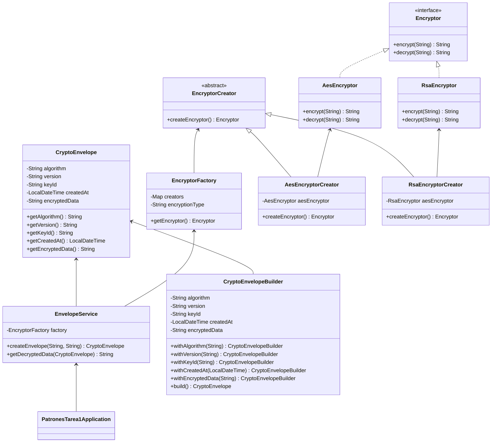

# Welcome to StackEdit!

### Resuelve el punto 3 de la Tarea 1 de PADISOFT:

En la aplicación, además de encriptar los datos con la fábrica del Punto 2, se requiere  
almacenar no solo el valor cifrado, sino también información adicional como:  
- el algoritmo usado,  
- la versión de la encriptación,  
- el identificador de la clave,  
- y la fecha en que se generó.  

Como este objeto tiene muchos atributos, no es práctico usar un constructor con  
demasiados parámetros.  
Implementar el patrón Builder para crear un objeto llamado, por ejemplo,  
CryptoEnvelope, que contenga tanto el dato cifrado como la metadata necesaria.  

### Requisitos mínimos:
1. Definir la clase CryptoEnvelope con varios atributos (algoritmo, versión, clave,  
fecha, dato cifrado , entre otros ).
2. Implementar un Builder que permita construir el objeto paso a paso mediante  
métodos como withAlgorithm(...), withVersion(...), etc.  
3. Usar el método build() para obtener el objeto final.  
4. Demostrar que se puede crear un CryptoEnvelope de manera clara y legible,  
sin usar constructores con muchos parámetros.  

### Restricciones :
- El objeto final debe ser inmutable: una vez construido, no se puede modificar.  
- El Builder debe asegurar que los campos obligatorios estén presentes.  
- Se deben utilizar los recursos del framework para la correcta implementación  
del patrón.  

### Entregables : 
- Código fuente de la clase y el Builder.  
- Un diagrama UML de clases, respetando las convenciones .  
- Un ejemplo de ejecución donde se muestre cómo se crea un objeto CryptoEnvelope con el patrón Builder.

## Diagrama UML 

