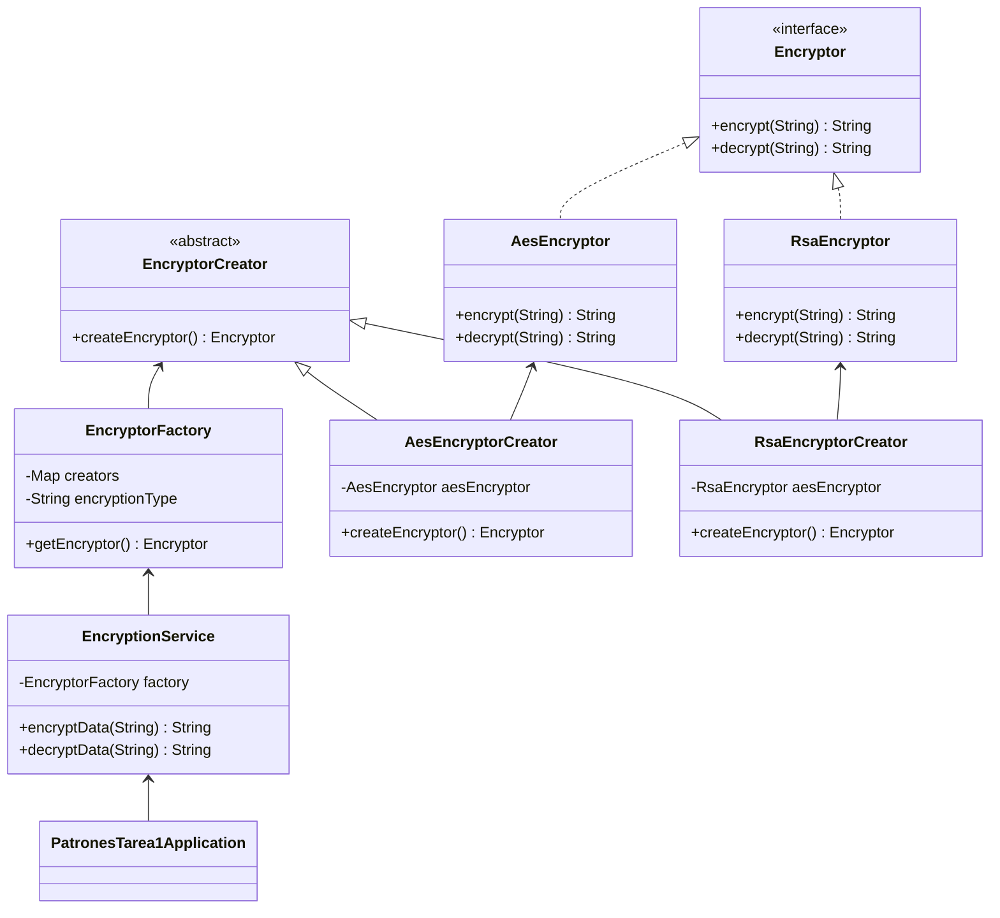

# Welcome to StackEdit!

### Resuelve el punto 2 de la Tarea 1 de PADISOFT:

Sobre el framework establecido en el punto anterior: Spring(Java)

Usando el patrón Factory Method para Fábrica de cifradores para datos sensibles
La aplicación debe almacenar números de tarjeta de crédito y otros datos
sensibles sin guardarlos en texto plano. Según una configuración (p. ej., “AES” o
“RSA”), el sistema debe cifrar antes de guardar y descifrar al leer.

Debe implementar el patrón Factory Method para crear el cifrador adecuado sin
que la capa de dominio conozca clases concretas.

Requisitos mínimos
1. Definir una interfaz Producto que permita encriptar y descifrar información:
2. Definir un creador abstracto con el factory method.
3. Definir creadores concretos (Concrete Creators), cada uno sobrescribe el
factory method:
- AesEncryptorCreator → retorna AesEncryptor
- RsaEncryptorCreator → retorna RsaEncryptor
- Con el objetivo de cumplir los principios SOLID, podrán agregarse nuevos productos sin necesidad de modificar las clases existente.

4. La selección del creador se hace por configuración (string como “AES”,
“RSA”) y debe hacer uso de los principios de inyección e inversión de
dependencias.
5. Debe existir una prueba simple que demuestre el funcionamiento de la
fábrica y los cambios de configuración
Restricciones
- Mantener bajo acoplamiento: el código de dominio solo conoce
EncryptorCreator y Encryptor.
- Se deben utilizar los recursos del framework para la correcta implementación
del patrón.

### Entregables
- Código fuente con las clases.
- Diagrama UML del problema.
- Explicación donde se evidencie la ejecución y los resultados obtenidos.

## How to run
Si tiene un ambiente listo para correr proyectos de Springboot:

mvn spring-boot:run

## Diagrama UML 

